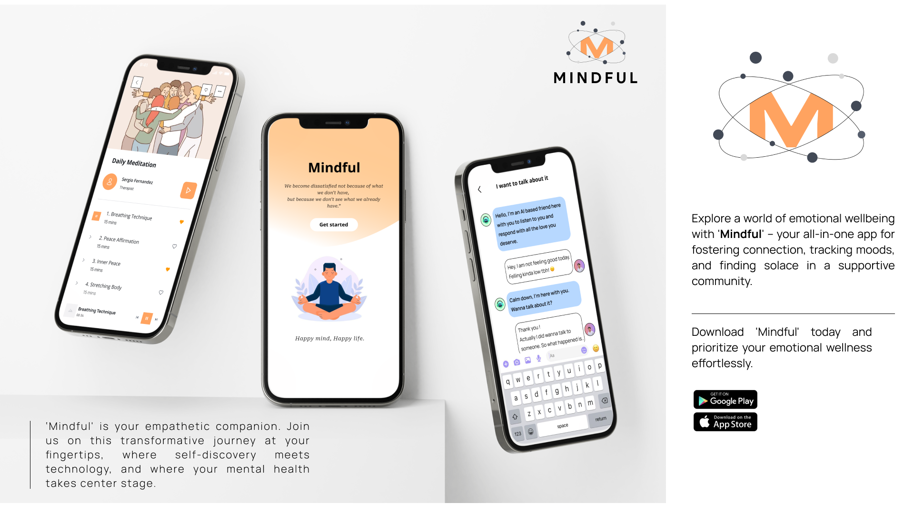

# MINDFUL
MINDFUL is our vision for Google Sollution Challenge 2024

Welcome to our Mental Well-being Application repository! This application aims to provide a comprehensive platform for users to enhance their mental health and well-being through innovative features and technologies.

## **Features**
### 1. **Chatbot Support:**
Leverage AI-powered chatbots to provide instant support, guidance, and a listening ear for users.

### 2. **Anonymous Messaging:**
Enable users to engage in anonymous conversations, fostering open communication and support between users.

### 3. **Community Forums:**
Establish community-driven forums for users to share experiences, insights, and support anonymously.

### 4.  Personalization with ML:
Implement machine learning algorithms to personalize user experiences based on individual preferences and mental health needs.

## Further Vision

### 1. **Multilingual Support:**
   - Striving to make our application accessible to a global audience by expanding language support and ensuring inclusivity for diverse communities.

### 2. **Wearable Device Integration:**
   - Exploring deeper integration with wearable devices to provide users with more comprehensive insights into their mental well-being and health.

### 3. **Continuous Improvement:**
   - Dedicated to a culture of continuous improvement, we plan to regularly update and refine the application based on user feedback, emerging technologies, and advancements in mental health research.

### 4. **Partnerships with Professionals:**
   - Seeking collaborations with mental health professionals, researchers, and organizations to enhance the depth and quality of support services within the application. Our goal is to offer a holistic and expert-driven approach to mental well-being.

We believe that by embracing these principles, we can create a lasting impact and contribute to the ongoing conversation surrounding mental health and wellness.

## Getting Started
Prerequisites
Flutter installed on your development environment.
Android Studio or Xcode for native development.
Google Cloud account for backend services.
## Installation
1. Clone the repository:

        git clone https://github.com/your-username/MINDFUL.git

2. Navigate to the project directory:

        cd mental-wellbeing-app

3. Install dependencies:

         flutter pub get

4. Run the application:

        flutter run

## Contributing
We welcome contributions! Feel free to open issues, submit pull requests, or provide feedback on how we can improve the application.

Feel free to customize this README according to your project's specific details, and provide more detailed instructions if needed.

